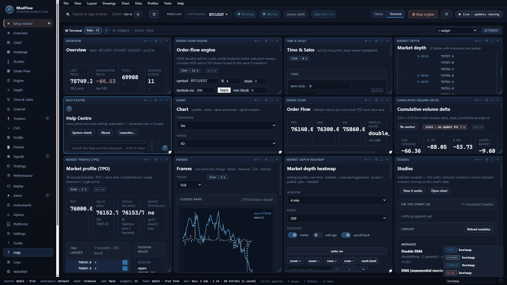
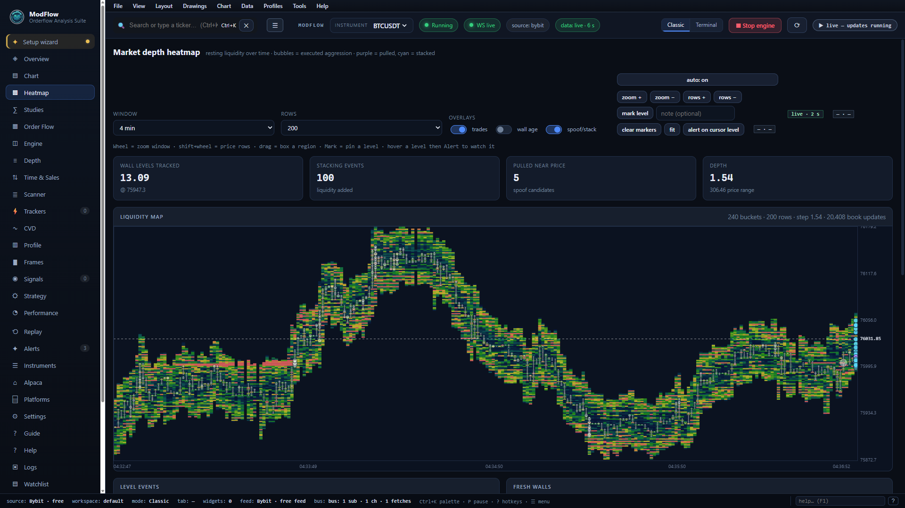
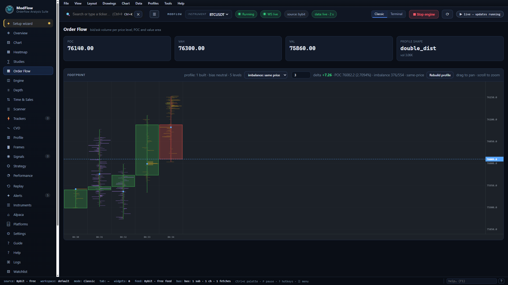
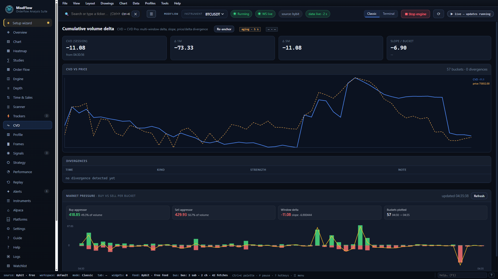
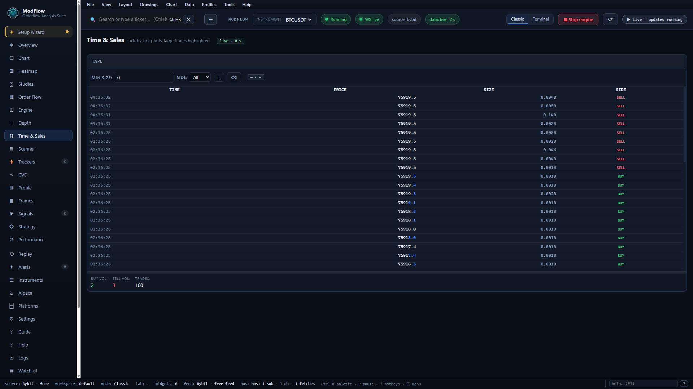
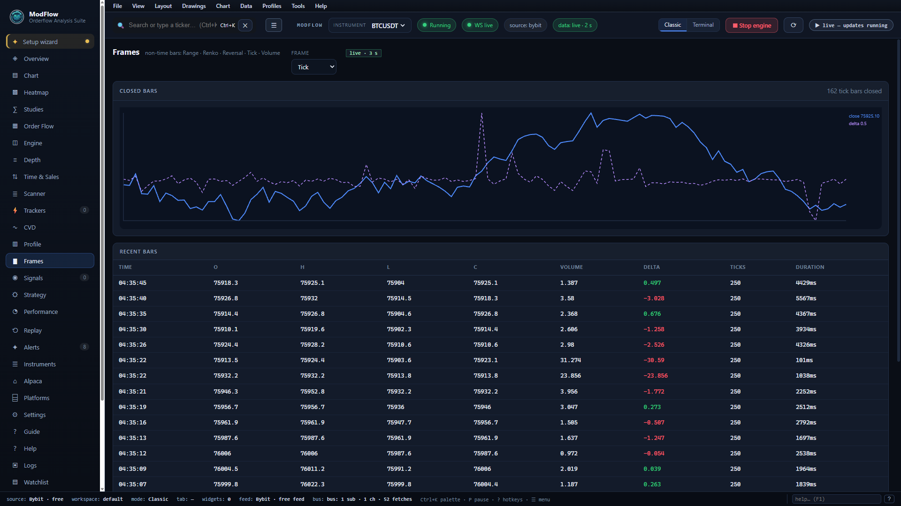
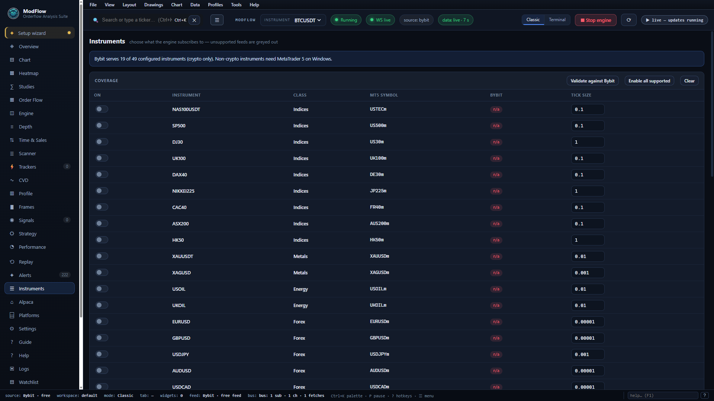
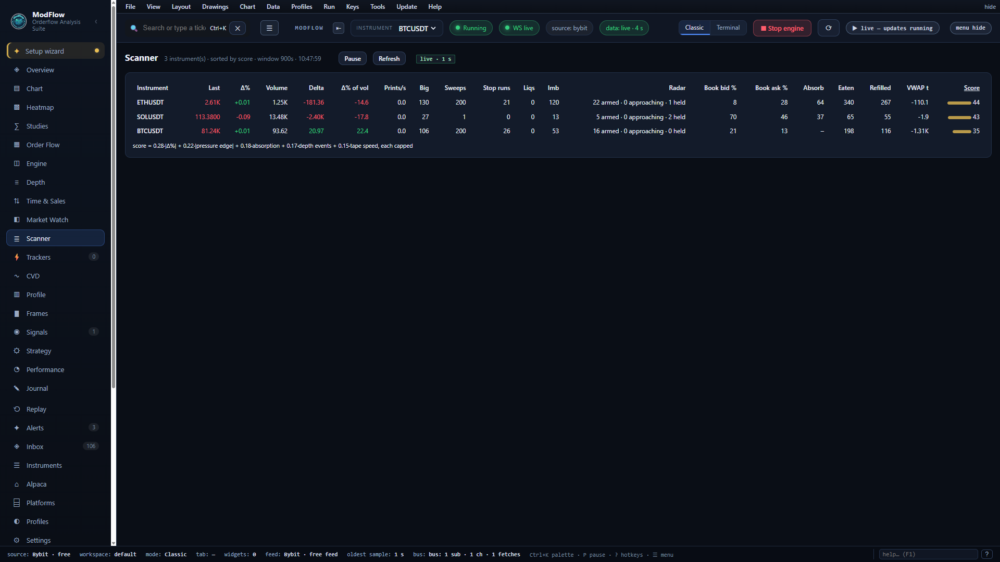
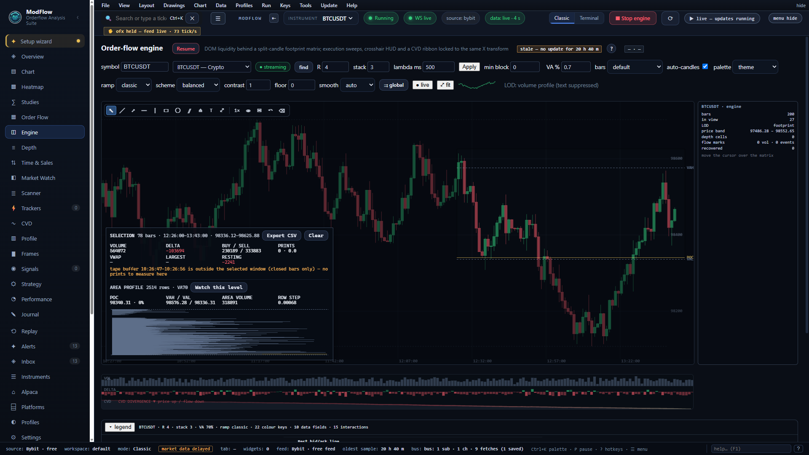

# ModFlow OrderFlow Analysis Suite

> **Real-time orderflow trading system** — tick-level microstructure analysis, 5 pattern detectors, volume profile framing, state machine trade lifecycle, seven venue integrations (Bybit · Binance · Hyperliquid · OKX · MT5 · Alpaca · NinjaTrader 8), FastAPI dashboard with WebSocket, Telegram alerts. Built on Fabio Testa's methodology.

[](.)
[](LICENSE)
[](.)
[](.)
[](.)
[](CONTRIBUTING.md)

**Where it sits:** ModFlow is an analytics layer, not a broker terminal — it reads the market in
depth and sits beside whatever you execute in. No order tickets, no positions, no sign-up; your
terminal stays your terminal. What it carries is everything *around* the order flow — news,
calendar, fundamentals, options, journal, alerts — in the same window as the footprint, from the
same live feed.

---

## See It Running

Everything below is the packaged desktop app streaming the live Bybit feed — no mock-ups.



<table>
  <tr>
    <td width="50%"></td>
    <td width="50%"></td>
  </tr>
  <tr>
    <td></td>
    <td></td>
  </tr>
  <tr>
    <td></td>
    <td></td>
  </tr>
</table>

All thirty-two screenshots — one per view, plus the terminal board and the Help Centre search — live in
**[docs/SCREENSHOTS.md](docs/SCREENSHOTS.md)** with captions.

---

## Golden Features

Three reads set the suite apart from the usual study rack — a **level radar** that tracks every
level's lifecycle across the whole watchlist, an **area volume profile** you can box anywhere and
hand straight to the alerts, and the **precision reads** (unfinished business and node
persistence) borrowed from the professional numbers-bar toolchains.

<table>
  <tr>
    <td width="50%"></td>
    <td width="50%"></td>
  </tr>
</table>

- **Level radar** — armed → approaching → defended / confirmed → spent / failed, ranked per
  instrument in the Scanner's Radar column, announced in plain sentences, with each level's first
  test counted for you.
- **Area volume profile** — drag any region on the Engine: volume-at-price, POC / VAH / VAL, a
  histogram and a CSV export; one button turns the POC into a watched level.
- **Unfinished business & node persistence** — incompletely auctioned extremes drawn until price
  fixes them, and double/triple nodes drawn as repeat-acceptance bands. Both feed the radar.

The full write-up, with the reasoning behind each, is in
**[docs/GOLDEN_FEATURES.md](docs/GOLDEN_FEATURES.md)**.

---

## Multiple monitors

Every panel can live in its own real window, on any monitor you have — a depth map pinned on the
second screen, the tape on the third, the board itself wherever you left it.

- **One click to place.** A widget's **⧉** button (Terminal mode) or **View → Windows & layouts…**
  opens any panel on any monitor, already placed — left half, right half, a corner, centred or
  filling the screen. Ten shapes, every display, in both the Terminal and the Classic layout.
- **One click to move.** Send an open window to another monitor, or snap it where it is, from its
  row in the window menu, from the Windows & layouts dialog, or from the window's own bar.
  **Ctrl+Alt+Shift+←/→** moves the panel you are working on one monitor over; **Ctrl+Alt+W** opens
  its window menu.
- **It remembers — and it rescues.** Positions are saved, so tomorrow's launch rebuilds the same
  desk; if a monitor is not there any more, the window comes home to the primary rather than
  sitting off-screen, and **Bring them home** in the dialog rescues every stranded window at once.

A note on the honest limit: dragging a panel out of the board with the mouse is not possible inside
the app's embedded browser (a page cannot start an operating-system window drag), so moving and
placing are commands — one click, or one shortcut, each.

---

## Credit & Lineage

The original **OrderFlow Analysis Pro** — the microstructure engines, the five pattern detectors,
the volume-profile framing, the dashboard foundation — is
**[mahmoud20138/OrderFlow-Analysis-Pro](https://github.com/mahmoud20138/OrderFlow-Analysis-Pro)**,
MIT licensed. This distribution began from that repository (commit `b2ff4ee`) and grew into the
desktop suite you see here; the original copyright notice is retained in [LICENSE](LICENSE)
alongside the notice for the modifications. If the original project is useful to you,
give it a star: **<https://github.com/mahmoud20138/OrderFlow-Analysis-Pro>**

---

## Status, limitations & privacy

**v0.1.0-beta.** The suite runs a live venue feed, a canvas UI and a local API, and it is
published so it can be read, run and reviewed — not as a finished product. What that means in
practice:

**Release identity.** The package and artifact version is `0.1.0`; the public release is
tagged **`v0.1.0-beta`** — the label used in this README and in `SECURITY.md`.

- **Feed data is only as good as the venue.** The suite does not invent guarantees the exchanges
  do not provide: there is no trade-level gap detection or replay, Alpaca's free `iex` feed is a
  single-venue subset, and a venue that goes quiet looks quiet — each feed reports its own
  staleness in the `data:` chip and the freshness stamps.
- **Beta scope.** Signals, footprints and profiles are analysis aids, not advice (see the
  Disclaimer). Windows is the tested platform and the frozen build is Windows-only; the source
  tree runs anywhere Python 3.11+ does, but CI exercises Windows only.
- **Your data stays on your machine.** The app binds a loopback-only server on `127.0.0.1`; there
  is no telemetry and no analytics. The only outbound calls are the market-data feeds you
  configure, SEC/CoinGecko look-ups the fundamentals panel makes on demand, and the update check
  (GitHub's release API, on a slow configurable interval — Settings ▸ Updates). Configuration,
  logs and the SQLite database live in `%APPDATA%\OrderFlowAnalysisPro`; nothing is uploaded.
- **Credentials are yours.** Keys you enter are stored in that same per-user config; the repo
  ships no keys, and no `.env` file is read from the repository directory.

---

## Table of Contents

- [See It Running](#see-it-running)
- [Status, limitations & privacy](#status-limitations--privacy)
- [Golden Features](#golden-features)
- [Multiple monitors](#multiple-monitors)
- [Credit & Lineage](#credit--lineage)
- [What Is OrderFlow Analysis?](#what-is-orderflow-analysis)
- [System Overview](#system-overview)
- [Architecture](#architecture)
- [The 5 Core Patterns](#the-5-core-patterns)
- [Volume Profile Framing](#volume-profile-framing-daily-bias)
- [State Machine Trade Lifecycle](#state-machine-trade-lifecycle)
- [Supported Instruments (49)](#supported-instruments-49)
- [Data Sources](#data-sources)
- [Dashboard](#dashboard)
- [Telegram Alerts](#telegram-alerts)
- [Database](#database)
- [Installation](#installation)
- [Configuration](#configuration)
- [Usage](#usage)
- [Project Structure](#project-structure)
- [File Inventory](#file-inventory)
- [API Reference](#api-reference)
- [Demo Mode](#demo-mode)
- [Signal Output Examples](#signal-output-examples)
- [How Pattern Detection Works](#how-pattern-detection-works)
- [Composite Scoring System](#composite-scoring-system)
- [Contributing](#contributing)
- [License](#license)
- [Disclaimer](#disclaimer)

---

## What Is OrderFlow Analysis?

OrderFlow analysis reads **market microstructure** — the tick-by-tick footprint of buyers and sellers — to understand who is in control before price reflects it. Unlike traditional technical analysis that looks at candles and indicators, orderflow looks **inside the candle**:

```
Traditional Analysis              OrderFlow Analysis
─────────────────────             ─────────────────────
Looks at: OHLC candles             Looks at: Every tick (price + volume + side)
Timeframe: 1m, 5m, 1H             Timeframe: Tick-level (milliseconds)
Answers: What happened?            Answers: WHO did it and WHY?
Indicators: RSI, MACD, MA         Engines: Delta, Footprint, Volume Profile, Orderbook
Lagging: Yes (averages)            Leading: No (real-time microstructure)
```

### Key Concepts

| Concept | What It Measures | Why It Matters |
|---------|-----------------|----------------|
| **Delta** | Buy volume minus sell volume per candle/level | Who is aggressive — buyers or sellers? |
| **Cumulative Delta** | Running total of delta over time | Is buying/selling pressure building or fading? |
| **Footprint** | Volume at each price level split by bid/ask | Where did the heavy trading happen inside the candle? |
| **Volume Profile** | Total volume traded at each price over a session | Where is the "fair value" — POC, VAH, VAL? |
| **Orderbook** | Limit orders waiting at each price level | Where are the walls? Thin levels = easy to sweep. |
| **Absorption** | Aggressive volume with no price movement | Someone is defending a level with limit orders. |
| **Initiative** | Aggressive volume WITH price movement | Institutional conviction pushing price. |
| **Dealer gamma (GEX)** | The gamma option dealers carry, strike by strike, with the call/put walls | Which strikes pin price, and where a hedge-driven move accelerates? |
| **IV smile & 25Δ skew** | Implied volatility per strike and expiry, and the put-vs-call wings | What is the options market pricing for this expiry, and which wing is bid? |
| **Option flow** | Option prints classified into sweeps, blocks and unusual premium | Where is the size going, and in which strikes? |
| **Market read** | A deterministic read of the engine's own state — regime, conviction, key levels | What do the live analyzers agree on right now? |

---

## System Overview

```
┌─────────────────────────────────────────────────────────────────────────────┐
│                         ModFlow OrderFlow Analysis Suite                              │
│                                                                             │
│  ┌──────────────────────┐     ┌──────────────────────────────────────┐      │
│  │   DATA SOURCES       │     │   ANALYTICS ENGINES (per instrument) │      │
│  │                      │     │                                      │      │
│  │  ┌────────┐ ┌──────┐ │     │  Volume Profile  ── POC, VAH, VAL,  │      │
│  │  │  MT5   │ │Bybit │ │────▶│  Delta Engine    ── vertical, horiz,│      │
│  │  │  Feed  │ │ Feed │ │     │  Footprint       ── bid/ask/level,  │      │
│  │  └────────┘ └──────┘ │     │  Orderbook       ── L2 depth, thin  │      │
│  └──────────────────────┘     └───────────────┬──────────────────────┘      │
│                                               │                              │
│  ┌────────────────────────────────────────────▼──────────────────────────┐  │
│  │                    5 PATTERN DETECTORS                                 │  │
│  │  Absorption · Initiative · Sweep · Exhaustion · Divergence            │  │
│  └────────────────────────────────────────────┬──────────────────────────┘  │
│                                               │                              │
│  ┌────────────────────────────────────────────▼──────────────────────────┐  │
│  │                    SIGNAL PROCESSING                                   │  │
│  │  Profile Framing (P/b/D shapes) → Qualified Levels → Daily Bias      │  │
│  │  Signal Aggregator (state machine) → Composite Score (0-100)         │  │
│  └────────────┬──────────────────────────────────┬───────────────────────┘  │
│               │                                  │                          │
│  ┌────────────▼──────────┐  ┌───────────────────▼────────────────────┐     │
│  │   Telegram Alerts     │  │   FastAPI Dashboard                    │     │
│  │   Entry/BE/Trail/Exit │  │   192 REST/WS routes + streams         │     │
│  │   Daily Bias updates  │  │   Charts, VP, Footprint, Orderbook     │     │
│  └───────────────────────┘  │   Scanner, Strategy Status, Tape       │     │
│                              └───────────────────────────────────────┘     │
│  ┌────────────────────────────────────────────────────────────────────┐     │
│  │   SQLite Database (WAL mode)                                       │     │
│  │   ticks · candles · volume_profiles · signals · trade_journal     │     │
│  └────────────────────────────────────────────────────────────────────┘     │
│                                                                             │
└─────────────────────────────────────────────────────────────────────────────┘
```

---

## Architecture

### Data Flow Pipeline

```
                     ┌─────────────┐
                     │  MT5 Feed   │──── Tick polling (100ms)
                     │  (613L)     │──── Market Book (DOM)
                     │             │──── Historical download
                     └──────┬──────┘
                            │
     ┌──────────────┐       │       ┌──────────────┐
     │  Bybit Feed  │───────┤       │   Database   │
     │  (394L)      │       ├──────▶│  (673L)      │
     │  WebSocket   │       │       │  SQLite WAL  │
     │  Free, no key│       │       └──────────────┘
     └──────────────┘       │
                            ▼
                   ┌─────────────────┐
                   │ Candle Builder  │ ← Tick → 1m aggregation
                   │ (168L)          │ ← Footprint per level
                   └────────┬────────┘
                            │
              ┌─────────────┼──────────────┐
              ▼             ▼              ▼
     ┌──────────────┐ ┌──────────┐ ┌──────────────┐
     │ Volume Prof. │ │  Delta   │ │  Footprint   │
     │ Engine (343L)│ │Engine    │ │  Engine      │
     │              │ │ (207L)   │ │ (357L)       │
     │ POC/VAH/VAL  │ │ Vert/Hor│ │ Bid/Ask/Lvl  │
     │ LVN/Shape    │ │ Cumul.   │ │ Imbalance    │
     └──────┬───────┘ └────┬─────┘ └──────┬───────┘
            │              │              │
            ▼              ▼              ▼
     ┌─────────────────────────────────────────┐
     │        ORDERBOOK TRACKER (212L)          │
     │  L2 depth · Thin levels · Consumptions  │
     │  Path of least resistance               │
     └──────────────────┬──────────────────────┘
                        │
        ┌───────┬───────┼───────┬───────┬───────┐
        ▼       ▼       ▼       ▼       ▼       │
   ┌────────┐┌────────┐┌──────┐┌────────┐┌────────┐
   │Absorp- ││Initia- ││Sweep ││Exhaus- ││Diverg- │
   │tion    ││tive    ││      ││tion    ││ence    │
   │(267L)  ││(137L)  ││(143L)││(238L)  ││(160L)  │
   └───┬────┘└───┬────┘└──┬───┘└───┬────┘└───┬────┘
       │         │        │        │         │
       └─────────┴────┬───┴────────┴─────────┘
                      ▼
            ┌─────────────────────┐
            │  Profile Framing    │ ← P/b/D shape → Daily Bias
            │  (352L)             │ ← Qualified Levels (VAH/VAL/POC/LVN/Merged)
            └─────────┬───────────┘
                      ▼
            ┌─────────────────────┐
            │  Signal Aggregator  │ ← State machine (6 states)
            │  (540L)             │ ← Composite scoring (0-100)
            │                     │ ← SL/TP calculation
            └──────┬──────────────┘
                   │
       ┌───────────┼───────────────┐
       ▼           ▼               ▼
 ┌──────────┐ ┌──────────┐  ┌───────────────┐
 │ Telegram │ │Dashboard │  │  Database     │
 │ Bot      │ │ FastAPI  │  │  Journal      │
 │ (205L)   │ │ (1461L)  │  │  Logging      │
 └──────────┘ └──────────┘  └───────────────┘
```

### Module Dependency Graph

```
main.py (1341L) ─── System orchestrator
    │
    ├── config/settings.py (842L) ─── 31 instrument configs, 15 config dataclasses
    │
    ├── data/
    │   ├── models.py (341L) ─── 9 dataclasses: Tick, Candle, Signal, FootprintLevel, TradeState...
    │   ├── candle_builder.py (168L) ─── Tick → 1m aggregation + footprint
    │   ├── mt5_feed.py (613L) ─── MT5 terminal: ticks, book, history
    │   ├── bybit_feed.py (394L) ─── Bybit WebSocket: trades + orderbook
    │   ├── ninjatrader_feed.py (646L) ─── NinjaTrader 8 via the shipped read-only bridge
    │   └── database.py (673L) ─── SQLite: 5 tables, WAL mode
    │
    ├── analytics/
    │   ├── volume_profile.py (343L) ─── POC/VAH/VAL/LVN/shape
    │   ├── delta.py (207L) ─── Vertical + horizontal + cumulative delta
    │   ├── footprint.py (357L) ─── Bid/ask per level, imbalance detection
    │   └── orderbook.py (212L) ─── L2 depth, thin levels, consumption tracking
    │
    ├── patterns/
    │   ├── absorption.py (267L) ─── Effort >> result detection
    │   ├── initiative.py (137L) ─── Effort = result (momentum)
    │   ├── sweep.py (143L) ─── Thin book displacement
    │   ├── exhaustion.py (238L) ─── Declining volume at extremes
    │   └── divergence.py (160L) ─── Price vs delta disagreement
    │
    ├── signals/
    │   ├── profile_framing.py (352L) ─── Daily bias + qualified levels
    │   └── aggregator.py (540L) ─── State machine + composite scoring
    │
    ├── alerts/
    │   └── telegram_bot.py (205L) ─── Telegram notifications
    │
    └── dashboard/
        ├── app.py ─── FastAPI host: REST + WebSocket (the app mounts its routers here)
        ├── websocket_manager.py ─── 10-channel broadcast with throttling
        ├── demo_data.py ─── Deterministic demo data generator
        ├── __main__.py ─── Standalone launcher
        └── static/ ─── the legacy page's assets, served at /static/

    ├── atlas/ ─── live analytics (CVD, heatmap, imbalance, tapeflow, profiles)
    │   └── api.py ─── the /api/atlas/* surface (70 routes)
    │
    ├── desktop/ ─── the desktop application
    │   ├── launcher.py ─── pywebview window / --headless server
    │   ├── api.py ─── /api/control/* (config, feeds, alerts, exports, layouts)
    │   ├── engine.py ─── the live pipeline host the UI reads from
    │   └── ui/ ─── vanilla-JS modules (~63,627L across 154 files) + index.html
```

---

## The 5 Core Patterns

The system detects 5 microstructure patterns based on Fabio Testa's methodology. Each outputs a **strength score (0-100)** and **directional bias (BUY/SELL)**.

### Pattern Overview

```
┌─────────────────────────────────────────────────────────────────────┐
│                     5 PATTERN DETECTORS                             │
│                                                                     │
│  1. ABSORPTION        2. INITIATIVE       3. SWEEP                  │
│  Effort >> Result     Effort = Result     Thin Book Displacement    │
│  ██████████           ██████████          ██████                    │
│  ██████████  (no      ██████████  (price  ██░░░░░░░ (price          │
│  ██████████   move)   ██████████   moves) ░░░░░░░░   moves fast)   │
│  Buyers/Sellers       Directional         Low volume                │
│  defending level      conviction          through empty levels      │
│                                                                     │
│  4. EXHAUSTION        5. DIVERGENCE                                 │
│  Declining Effort     Price vs Delta Disagreement                   │
│  ██  █  █            Price: ↗↗↗ NEW HIGH                            │
│  █  █  ▓             Delta: ↗↗↘  (failing)                         │
│  █  ▓  ░             Trend reversal warning                        │
│  ▓  ░  ░                                                           │
│  Volume fading                                                     │
│  at extremes                                                       │
│                                                                     │
└─────────────────────────────────────────────────────────────────────┘
```

### Detection Details

| # | Pattern | Detection Logic | Source Data | Signal Purpose |
|---|---------|----------------|-------------|----------------|
| 1 | **Absorption** | 2 methods: (a) Delta/price mismatch — positive delta + red candle = sellers absorbing, (b) High volume at level + low displacement + repeated attempts | Delta, Footprint, Price | **Entry signal** at VAH/VAL |
| 2 | **Initiative** | 5 criteria: delta ≥ threshold, volume ≥ 1.5x average, body ≥ 3 ticks, delta/price aligned, one-sided imbalance bonus | Delta, Footprint, Volume | **Break-even / trail trigger** |
| 3 | **Sweep** | Price through ≥3 thin orderbook levels + low volume per level + thin book confirmation (≥2 thin levels on swept side) | Orderbook, Price | **Liquidity grab / reversal alert** |
| 4 | **Exhaustion** | Price trending + volume declining >30% + negative volume/delta trend + optional contrarian imbalance at extreme | Volume trend, Delta ROC, Footprint | **Exit warning** — momentum fading |
| 5 | **Divergence** | Price new high/low but cumulative delta peak/trough fails to confirm (<80% of prior) | Price, Cumulative Delta peaks | **Trend reversal warning** |

### Strength Score Calculation

| Pattern | Score Formula | Range |
|---------|--------------|-------|
| Absorption | `(volume / min_aggressive) * 40` or `(vol / min_aggressive) * 30 + attempts * 15` | 0-75 |
| Initiative | `(delta/threshold)*20 + vol_accel*15 + body_ticks*5 + imbalance_count*10` | 0-50+ |
| Sweep | `levels*15 + efficiency*20 + displacement*1000 + thin_confirm*15` | 30-100 |
| Exhaustion | `40 + |vol_trend|*5 + |delta_roc|*5 + contrarian_bonus(20)` | 40-70 |
| Divergence | `30 + (1 - ratio)*40 + price_new_extreme*10` | 30-80 |

---

## Volume Profile Framing (Daily Bias)

Implements Fabio Testa's **profile shape analysis** to determine the daily directional bias and identify **qualified levels** to trade from.

### Profile Shapes

```
P-SHAPE (Buyers in Control)        b-SHAPE (Sellers in Control)
Volume │                           Volume │
  █    │                                  │ █
  ██   │                                  │ ██
  ███  │     POC > 65%                    │ ███     POC < 35%
  ████ │     Bias: LONG                   │ ████    Bias: SHORT
  █████│                                  │ ██████
───────┼────────── Price            ──────┼────────── Price
  VAL  │  POC  VAH                         VAH  POC  VAL

D-SHAPE (Balanced)                  DOUBLE DISTRIBUTION
Volume │                           Volume │
  █    │       █                          │ ████    ████
  ██   │      ██                          │ ████    ████
  ███  │     ███   POC ~50%               │  ░░░░░░░░░░   (valley)
  ████ │    ████  Bias: NEUTRAL           │ ████    ████  Bias: TRANSITION
───────┼────────── Price            ──────┼────────────────── Price
  VAL  │ POC │ VAH                         VAH₁  VAL₁  VAH₂  VAL₂
```

| Shape | POC Position | Bias | Confidence Base | Trading Plan |
|-------|-------------|------|----------------|-------------|
| **P-shape** | >65% from bottom | LONG | 40 + poc_pct×30 | Buyers in control, buy dips to VAL |
| **b-shape** | <35% from bottom | SHORT | 40 + (1-poc_pct)×30 | Sellers in control, sell rallies to VAH |
| **D-shape** | ~50% | NEUTRAL | 20 | Balanced, fade extremes |
| **Double Distribution** | Bimodal (valley <50% of peaks) | NEUTRAL | 30 | Transition — watch for breakout |

### Qualified Levels

```
┌─────────────────────────────────────────────────────────────────┐
│                  QUALIFIED LEVELS (Trade From These)             │
│                                                                  │
│  Price ▲                                                         │
│       │     ┌─── VAH (Value Area High) ─── SELL ZONE            │
│       │     │                                                    │
│       │     │    ┌── MERGED VAH ─── Strong SELL (str=70)        │
│       │     │    │  (confluent across multiple days)             │
│       │     │                                                    │
│       │     │  ┌── LVN (Low Volume Node) ─── Rebalancing        │
│       │     │  │  (price magnet — gaps fill fast)                │
│       │     │  │                                                │
│       │  ┌──┤  │  ┌── POC (Point of Control) ─── Pivot          │
│       │  │  │  │  │  (highest volume = fair value)               │
│       │  │  │  │  │                                            │
│       │  │  ├──┤  │  ┌── MERGED VAL ─── Strong BUY (str=70)    │
│       │  │  │  │  │  │  (confluent across multiple days)        │
│       │  │  │  │  │  │                                        │
│       │  └──┤  │  │  │  └── VAL (Value Area Low) ─── BUY ZONE  │
│       │     │  │  │                                           │
│       └─────┘  │  └────────────────────────────────────         │
│                │                                                 │
│  Confluence Bonus: +20 strength when level matches across days  │
│  Multi-day merge: overlapping profiles (>30% VA overlap) merged │
└─────────────────────────────────────────────────────────────────┘
```

### Multi-Day Context Checks

| Check | What It Does | Effect |
|-------|-------------|--------|
| Value accepted higher | Current VA above prior VA | +15 confidence if aligned with bias |
| VAH rejection | Price rejected at VAH across multiple days | Bias → WARNING, -10 penalty to composite score |
| Failed auction ("hooks") | Bullish hook below VAL, bearish hook above VAH | Reduces confidence |

---

## State Machine Trade Lifecycle

Every instrument runs an independent state machine. The system watches qualified levels, detects absorption entries, manages the trade through break-even and trailing stops, and auto-closes on strong exit signals.

```
╔══════════════════════════════════════════════════════════════════════════╗
║                    STATE MACHINE TRADE LIFECYCLE                        ║
╠══════════════════════════════════════════════════════════════════════════╣
║                                                                          ║
║   ┌─────────────────────────────────────────────────────────────┐        ║
║   │  NO ACTIVE TRADE                                            │        ║
║   │  Price approaches qualified level (strength >= 50)          │        ║
║   │  Aggregator auto-watches level                              │        ║
║   └────────────────────────┬────────────────────────────────────┘        ║
║                            │                                             ║
║                            ▼                                             ║
║   ┌─────────────────────────────────────────────────────────────┐        ║
║   │  WATCHING                                                   │        ║
║   │  Monitoring level for absorption or sweep signals           │        ║
║   └───────┬────────────────────────────────┬────────────────────┘        ║
║           │ ABSORPTION detected            │ SWEEP detected              ║
║           │ (composite >= 40)              │ (thin book displacement)    ║
║           ▼                                 ▼                            ║
║   ┌──────────────┐               ┌──────────────────────┐               ║
║   │ ABSORPTION   │               │ ALERT ONLY           │               ║
║   │ DETECTED     │               │ (sweep notification, │               ║
║   │ (transient)  │               │  no entry)           │               ║
║   └──────┬───────┘               └──────────────────────┘               ║
║          │ Entry signal sent, SL/TP calculated                            ║
║          ▼                                                                ║
║   ┌─────────────────────────────────────────────────────────────┐        ║
║   │  POSITION_OPEN                                              │        ║
║   │  Trade entered. Waiting for initiative (BE trigger)         │        ║
║   │  OR watching for exit warnings (exhaustion/divergence)      │        ║
║   └───────┬────────────────────────────────┬────────────────────┘        ║
║           │ INITIATIVE (same dir)          │ EXIT WARNING (opposite dir) ║
║           │ Move SL to entry price         │ str >= 70 → auto-close      ║
║           ▼                                 ▼                            ║
║   ┌──────────────┐               ┌──────────────────────┐               ║
║   │ BREAK_EVEN   │               │ CLOSED               │               ║
║   │ SL = entry   │               │ (auto-close on strong │               ║
║   │ Risk-free    │               │  exit signal)         │               ║
║   └──────┬───────┘               └──────────────────────┘               ║
║          │ INITIATIVE (same dir)                                             ║
║          │ Trail SL to candle extreme                                        ║
║          ▼                                                                  ║
║   ┌─────────────────────────────────────────────────────────────┐         ║
║   │  TRAILING                                                   │         ║
║   │  SL trails to candle low (longs) or high (shorts)           │         ║
║   │  Each new initiative print moves the trail                  │         ║
║   └───────┬────────────────────────────────┬────────────────────┘         ║
║           │ More INITIATIVE               │ EXIT WARNING (str>=70)        ║
║           │ Keep trailing                 │ or SL hit                     ║
║           ▼                                 ▼                              ║
║   ┌──────────────┐               ┌──────────────────────┐                ║
║   │ (loop back)  │               │ CLOSED               │                ║
║   │ TRAILING     │──────────────▶│ Trade logged to      │                ║
║   │              │               │ journal + Telegram   │                ║
║   └──────────────┘               └──────────────────────┘                ║
║                                                                            ║
╚══════════════════════════════════════════════════════════════════════════╝
```

---

## Supported Instruments (49)

Each instrument has **pre-tuned thresholds** for all 5 pattern detectors, optimized for its volatility and tick size.
49 ship configured in total — the 31 base specs tabled below plus 18 crypto majors that carry the same pre-tuned
thresholds (`GET /api/instruments` lists them all).

### Index Futures (9)

| Instrument | Tick Size | Absorption Min Vol | Initiative Min Delta | VP Tick Size | Session |
|-----------|-----------|-------------------|---------------------|-------------|---------|
| NAS100 | 0.1 | 50 | 30 | 1.0 | NY Cash |
| SP500 | 0.1 | 40 | 25 | 1.0 | NY Cash |
| DJ30 | 1.0 | 40 | 25 | 5.0 | NY Cash |
| UK100 | 0.1 | 30 | 20 | 1.0 | London |
| DAX40 | 0.1 | 30 | 20 | 2.0 | London |
| NIKKEI225 | 1.0 | 30 | 20 | 50.0 | Asian |
| CAC40 | 0.1 | 25 | 18 | 1.0 | London |
| ASX200 | 0.1 | 25 | 18 | 1.0 | Asian |
| HK50 | 1.0 | 25 | 18 | 5.0 | Asian |

### Metals, Energy, Crypto

| Instrument | Category | Tick Size | VP Tick Size | Session |
|-----------|----------|-----------|-------------|---------|
| XAUUSDT (Gold) | Metal | 0.01 | 0.50 | NY Cash |
| XAGUSD (Silver) | Metal | 0.001 | 0.05 | Full Day |
| USOIL | Energy | 0.01 | 0.10 | NY Cash |
| UKOIL | Energy | 0.01 | 0.10 | London |
| BTCUSDT | Crypto | 0.01 | 10.0 | Full Day |

### Forex (10 Pairs)

| Instrument | Tick Size | VP Tick Size | Session |
|-----------|-----------|-------------|---------|
| EURUSD | 0.00001 | 0.0005 | Full Day |
| GBPUSD | 0.00001 | 0.0005 | Full Day |
| USDJPY | 0.001 | 0.05 | Full Day |
| AUDUSD | 0.00001 | 0.0005 | Full Day |
| USDCAD | 0.00001 | 0.0005 | Full Day |
| USDCHF | 0.00001 | 0.0005 | Full Day |
| NZDUSD | 0.00001 | 0.0005 | Full Day |
| EURGBP | 0.00001 | 0.0005 | Full Day |
| EURJPY | 0.001 | 0.05 | Full Day |
| GBPJPY | 0.001 | 0.05 | Full Day |

### US Stocks (7)

| Instrument | Tick Size | VP Tick Size | Session |
|-----------|-----------|-------------|---------|
| AAPL | 0.01 | 0.50 | NY Cash |
| TSLA | 0.01 | 0.50 | NY Cash |
| AMZN | 0.01 | 0.50 | NY Cash |
| MSFT | 0.01 | 0.50 | NY Cash |
| NVDA | 0.01 | 0.50 | NY Cash |
| META | 0.01 | 0.50 | NY Cash |
| GOOGL | 0.01 | 0.50 | NY Cash |

---

## Data Sources

### Dual Feed Architecture

```
┌────────────────────────────────────────────────────────────┐
│                     DATA SOURCE OPTIONS                     │
│                                                             │
│  ┌─────────────────────┐    ┌─────────────────────────┐   │
│  │      MT5 FEED        │    │      BYBIT FEED         │   │
│  │                      │    │                         │   │
│  │  Source: MT5 terminal│    │  Source: Bybit WebSocket│   │
│  │  Requires: Account   │    │  Requires: Nothing      │   │
│  │  Ticks: 100ms polling│    │  Ticks: Real-time stream│   │
│  │  Orderbook: DOM data │    │  Orderbook: 50 levels   │   │
│  │  History: Up to 3 days│   │  History: None          │   │
│  │  Aggressor: Buy/Sell │    │  Aggressor: Trade side  │   │
│  │  flag from MT5       │    │  from Bybit API         │   │
│  └──────────┬───────────┘    └───────────┬─────────────┘   │
│             │                             │                  │
│             │  DATA_SOURCE = "MT5"        │  "BYBIT"         │
│             │  DATA_SOURCE = "BOTH" ──────┘                  │
│             │                                                │
│             ▼                                                │
│  ┌─────────────────────────────────────┐                    │
│  │  Symbol Auto-Discovery (MT5)        │                    │
│  │  200+ broker-specific name variants │                    │
│  │  e.g. USTEC, USTECm, NAS100, US100 │                    │
│  └─────────────────────────────────────┘                    │
└────────────────────────────────────────────────────────────┘
```

### MT5 Symbol Mapping

The system auto-discovers instruments across 200+ broker-specific naming variants:

| Internal | MT5 Symbol | Alternatives |
|----------|-----------|-------------|
| NAS100 | USTECm | USTEC, NAS100, US100, NQ100, NAS100USD... |
| XAUUSDT | XAUUSDm | XAUUSD, GOLD... |
| EURUSD | EURUSDm | EURUSD, EUR/USD... |
| BTCUSDT | BTCUSDm | BTCUSD, BTC/USD... |

---

## Dashboard

### Frontend Components

The current UI is the desktop suite: **154 vanilla-JS modules** (56 of them selftests) in `orderflow_system/desktop/ui/`
(shell and menus, chart, the order-flow engine, heatmap, tape, alerts, options, fundamentals, news,
search, watchlist, studies — no build step, no framework). The 8 modules listed below are the legacy
dashboard page's assets, still served at `/static/`:

```
┌──────────────────────────────────────────────────────────────────────┐
│                     ORDERFLOW DASHBOARD                              │
│                                                                      │
│  ┌───────────────────────────────────┐  ┌────────────────────────┐  │
│  │        PRICE CHART (app.js)       │  │   VOLUME PROFILE       │  │
│  │   the chart library lightweight-charts  │  │   Horizontal bars      │  │
│  │   Signal markers overlay:         │  │   POC, VAH, VAL marks  │  │
│  │   ▲ Absorption (teal)            │  │   Shape classification  │  │
│  │   ▲ Initiative (green)           │  │   LVN markers          │  │
│  │   ▲ Sweep (purple)               │  └────────────────────────┘  │
│  │   ● Exhaustion (yellow)                                        │
│  │   ● Divergence (orange)          ┌────────────────────────┐    │
│  │   ● Entry/Exit markers           │   FOOTPRINT CHART      │    │
│  └───────────────────────────────────┘│   Bid/Ask per level   │    │
│                                       │   Imbalance highlights │    │
│  ┌───────────────────────────────────┐└────────────────────────┘  │
│  │        SIGNAL CARDS (signals.js)  │                             │
│  │   Real-time trade recommendations │  ┌────────────────────────┐│
│  │   Entry/SL/TP/RR display          │  │  ORDERBOOK DEPTH       ││
│  │   Pattern breakdown               │  │  Bid/Ask ladder        ││
│  │   Grade (A+/A/B/C)                │  │  Thin level markers    ││
│  └───────────────────────────────────┘  │  Spread indicator      ││
│                                         └────────────────────────┘│
│  ┌───────────────────────────────────┐  ┌────────────────────────┐│
│  │  PERFORMANCE (performance.js)     │  │  TIME & SALES (tape.js)││
│  │  Win rate, PnL, RR distribution   │  │  Tick-by-tick feed     ││
│  │  Trade history                    │  │  Big trade highlights  ││
│  └───────────────────────────────────┘  └────────────────────────┘│
│                                                                      │
│  ┌───────────────────────────────────────────────────────────────┐  │
│  │              MICROSTRUCTURE (microstructure.js)               │  │
│  │  Market state · Session · Absorption · Delta · Exhaustion     │  │
│  └───────────────────────────────────────────────────────────────┘  │
└──────────────────────────────────────────────────────────────────────┘
```

### WebSocket Channels (9)

| Channel | Data | Throttle | Priority |
|---------|------|----------|----------|
| `tick` | Price, size, side | 200ms | High |
| `candle` | OHLCV + delta | None (immediate) | Critical |
| `signal` | AggregatedSignal | None (immediate) | Critical |
| `trade_state` | TradePhase transitions | None (immediate) | Critical |
| `volume_profile` | POC/VAH/VAL/shape | None | Normal |
| `bias` | DailyBias updates | None | Normal |
| `orderbook` | L2 depth + imbalance | 500ms | Normal |
| `delta` | Cumulative delta history | 200ms | Normal |
| `stats` | System-wide per-instrument | 5000ms | Low |

---

## Telegram Alerts

Automated notifications for every trade lifecycle event:

| Alert Type | Trigger | Content |
|-----------|---------|---------|
| **ENTRY SIGNAL** | Absorption at qualified level, composite ≥40 | Direction, score, pattern, delta, volume, bias, entry/SL/TP/RR |
| **BREAK EVEN** | First initiative auction after entry | SL moved to entry price — risk-free trade |
| **TRAIL UPDATE** | Subsequent initiative prints | New SL level, trail progress |
| **EXIT SIGNAL** | Trade closed (SL hit or auto-close) | PnL ticks, RR achieved, trade summary |
| **EXIT WARNING** | Exhaustion or divergence detected | Pattern details, strength, direction warning |
| **DAILY BIAS** | New VP shape computed | Shape, direction, confidence, POC/VAH/VAL, qualified levels |

---

## Database

### SQLite Schema (5 Tables)

```
┌─────────────────────────────────────────────────────────────────┐
│                    orderflow_data.db (WAL mode)                  │
│                                                                  │
│  ┌──────────┐ ┌──────────┐ ┌────────────────┐ ┌──────────┐    │
│  │  ticks    │ │ candles  │ │ volume_profiles│ │ signals  │    │
│  ├──────────┤ ├──────────┤ ├────────────────┤ ├──────────┤    │
│  │ id (PK)  │ │ id (PK)  │ │ id (PK)        │ │ id (PK)  │    │
│  │instrument│ │instrument│ │ instrument     │ │instrument│    │
│  │timestamp │ │timestamp │ │ session_date   │ │timestamp │    │
│  │ price    │ │timeframe │ │ poc, vah, val  │ │sig_type  │    │
│  │ size     │ │ OHLCV    │ │ total_volume   │ │direction │    │
│  │ side     │ │ buy/sell │ │ shape          │ │price_lvl │    │
│  │ trade_id │ │ delta    │ │ poc_pos_pct    │ │ strength │    │
│  └──────────┘ │footprint │ │ lvn (JSON)     │ │details   │    │
│               └──────────┘ │ vol_at_price   │ │  (JSON)  │    │
│                             └────────────────┘ └──────────┘    │
│                                                                  │
│  ┌──────────────┐                                               │
│  │ trade_journal│                                               │
│  ├──────────────┤                                               │
│  │ id (PK)      │                                               │
│  │ instrument   │                                               │
│  │ direction    │                                               │
│  │ entry/exit   │                                               │
│  │  time (ms)   │                                               │
│  │ entry/exit   │                                               │
│  │  price       │                                               │
│  │ SL, TP       │                                               │
│  │ pnl_ticks    │                                               │
│  │ rr_ratio     │                                               │
│  │ signals(JSON)│                                               │
│  │ notes        │                                               │
│  └──────────────┘                                               │
│                                                                  │
│  Indexes: (instrument, timestamp), (instrument, session_date)   │
│  PRAGMA: journal_mode=WAL, synchronous=NORMAL                   │
└─────────────────────────────────────────────────────────────────┘
```

---

## Installation

### Easiest — the ready-built installer (no Python needed)

Download **`ModFlowOrderFlowAnalysisSuite-Setup-0.1.0.exe`** from the
[beta builds lane](https://github.com/ModdySwag/ModFlow-beta-builds/releases/tag/v0.1.0-beta)
and run it. Per-user install (no admin prompt), Start-menu and desktop shortcuts, plain uninstall
from Add/Remove Programs. The portable zip and the SBOM sit beside it in the same release; the
release notes carry the sha256 of every file.

### From source — clone, one command, run

```bash
git clone https://github.com/ModdySwag/ModFlow-OrderFlow-Analysis-Suite.git
cd ModFlow-OrderFlow-Analysis-Suite
install.cmd            # Windows: creates .venv and installs the app + dev tooling
run.cmd                # ...then starts the desktop app (server + native window)
```

On Linux/macOS (or if you prefer to type it yourself):

```bash
python3 -m venv .venv
source .venv/bin/activate
pip install -e ".[dev]"
python -m orderflow_system.desktop
```

`install.cmd` never needs an "activate" step — it calls the virtual environment's own Python by
full path, which is exactly the step people get wrong by hand. It is safe to re-run: an existing
`.venv` is reused. `run.cmd` passes extra arguments straight through, e.g.
`run.cmd --headless --port 8099`.

<details>
<summary>Manual step-by-step (every shell), if you want to do it by hand</summary>

```bash
# 1. Clone
git clone https://github.com/ModdySwag/ModFlow-OrderFlow-Analysis-Suite.git
cd ModFlow-OrderFlow-Analysis-Suite

# 2. A Python 3.11+ virtual environment
python -m venv .venv
```

**3. Activate it — the command depends on the shell you are in:**

| Shell | Activation |
|---|---|
| Command Prompt (`cmd.exe`) | `.venv\Scripts\activate.bat` |
| PowerShell | `.\.venv\Scripts\Activate.ps1` — if the policy blocks it, run `Set-ExecutionPolicy -Scope Process Bypass` once, then retry |
| Git Bash / WSL | `source .venv/Scripts/activate` (POSIX systems: `source .venv/bin/activate`) |
| No activation at all | call the interpreter directly: `.venv\Scripts\python.exe -m orderflow_system.desktop` |

```bash
# 4. Install app + dev tooling
pip install -e ".[dev]"

# 5. (Optional) MT5 feed support
pip install -e ".[mt5]"

# 6. Run — any of
python -m orderflow_system.desktop                            # desktop app (native window)
python -m orderflow_system.desktop --headless --port 8099     # headless server (UI at /desktop)
python -m orderflow_system.main                               # CLI pipeline (feeds → detectors → Telegram)
```

</details>

#### `'.venv' is not recognized as an internal or external command`

That error is the activation line typed for the wrong shell — almost always **forward slashes in
`cmd.exe`**. `.venv/Scripts/activate` is a POSIX-style path; `cmd.exe` reads it as the name of a
program called `.venv` and fails exactly like this. Two fixes, either works:

1. Use your shell's row in the table above — in `cmd.exe` the Windows path uses backslashes:
   `.venv\Scripts\activate.bat`.
2. Skip activation entirely: `install.cmd` / `run.cmd` never activate anything, and
   `.venv\Scripts\python.exe -m orderflow_system.desktop` starts the app from any shell.

The same class of error appears when PowerShell refuses the script
(`Activate.ps1 cannot be loaded because running scripts is disabled`) — see the PowerShell row.

#### `'python' is not recognized...`

Python is not on your PATH. Install Python 3.11+ from <https://www.python.org/downloads/> and
tick **Add python.exe to PATH** in the installer — or skip Python entirely and use the ready-built
installer at the top of this section.

That's the whole path from zero to a running app. The rest of this section covers prerequisites and optional build steps.

### Prerequisites

- **Windows 10/11** for the packaged desktop build (source installs also run on Linux/macOS; the frozen-build script targets Windows)
- **Python 3.11 or newer** when running from source
- **MetaTrader 5 terminal** (optional, Windows only — the MT5 feed) or the built-in **Bybit** feed, which needs no account and no key

### Demo mode (no feed required)

```bash
python -m orderflow_system.dashboard               # deterministic demo data — the render test bed
python -m orderflow_system.dashboard --port 8099   # …or pin the port
```

The port rule matches the desktop app's: `--port` first, else `dashboard.port` from the per-user config (Windows: `%APPDATA%\OrderFlowAnalysisPro\config.json`), else 8080 — and when that port is already held by another process the next free one is used and printed, so a busy 8080 never blocks the demo server.

### Standalone executable

```bash
python scripts/build_exe.py           # -> dist/ModFlowOrderFlowAnalysisSuite/
```

### Next steps

How to run the system, dashboard endpoints, configuration, and per-instrument tuning are all in [Usage](https://github.com/ModdySwag/ModFlow-OrderFlow-Analysis-Suite#usage) and [Configuration](https://github.com/ModdySwag/ModFlow-OrderFlow-Analysis-Suite#configuration).

---

## Configuration

All configuration is in `orderflow_system/config/settings.py`:

```python
# Data source: "MT5", "BYBIT", or "BOTH"
DATA_SOURCE = DataSource.BYBIT

# MT5 credentials (only if using MT5 feed)
MT5 = MT5Config(
    login=12345678,
    password="your_password",
    server="YourBroker-Server",
    poll_interval_ms=100,       # Tick polling frequency
    enable_book=True,           # Enable market book (DOM)
    download_history_days=3,    # Download M1 history for warmup
)

# Telegram alerts
TELEGRAM = TelegramConfig(
    bot_token="your_bot_token",
    chat_id="your_chat_id",
    send_chart_snapshots=True,
)

# Dashboard
DASHBOARD = DashboardConfig(
    enabled=True,
    host="127.0.0.1",          # loopback by default; "0.0.0.0" exposes the API to your LAN
    port=8080,
    log_level="warning",
)

# Database
DB_PATH = "orderflow_data.db"
LOG_LEVEL = "INFO"
```

### Per-Instrument Threshold Tuning

Each instrument has its own config with tuned thresholds. Example for NAS100:

```python
AbsorptionConfig(
    min_aggressive_volume=50,      # Min volume to qualify as absorption
    max_price_displacement_ticks=2, # Max ticks price can move
    rolling_window_seconds=30,      # Lookback window
    min_attempts=2,                 # Min repeated attempts at level
    big_trade_filter=10,            # Volume threshold for "big" trade
)

InitiativeConfig(
    min_delta_threshold=30,          # Min delta to qualify
    volume_acceleration_min=1.5,     # Must be 1.5x average volume
    min_price_displacement_ticks=3,  # Min body size
    delta_price_alignment=True,      # Delta must align with candle direction
)
```

---

## Usage

### Start the System

```bash
python -m orderflow_system.main
```

The system will:
1. Connect to configured data source(s)
2. Download historical bars (MT5) or connect to live feed (Bybit)
3. Build initial volume profiles from historical data
4. Start 5 pattern detectors for all 49 configured instruments
5. Compute daily bias and qualified levels
6. Auto-watch strong levels (strength ≥ 50)
7. Begin state machine monitoring
8. Send Telegram alerts on signals
9. Serve dashboard at `http://localhost:8080`

### Dashboard Endpoints

```bash
# View all instruments
curl http://localhost:8080/api/instruments

# Get scanner ranking (all pairs by trade proximity)
curl http://localhost:8080/api/scanner

# Get strategy status for NAS100
curl http://localhost:8080/api/strategy-status/NAS100USDT

# Get volume profile
curl http://localhost:8080/api/volume-profile/NAS100USDT?days=5

# Get daily bias
curl http://localhost:8080/api/bias/NAS100USDT

# Get signal history
curl http://localhost:8080/api/signals/NAS100USDT?limit=50

# Get active trade state
curl http://localhost:8080/api/trade/NAS100USDT
```

---

## Project Structure

```
orderflow_system/
├── main.py                          # System orchestrator (1341L)
├── __init__.py                      # Package init
├── test_integration.py              # Integration tests (309L)
│
├── config/
│   └── settings.py                  # 31 instrument configs, 15 config dataclasses (842L)
│
├── data/
│   ├── models.py                    # 9 dataclasses: Tick, Candle, Signal, FootprintLevel, TradeState... (341L)
│   ├── candle_builder.py            # Tick → 1m candle aggregation (168L)
│   ├── bybit_feed.py                # Bybit WebSocket feed (394L)
│   ├── mt5_feed.py                  # MT5 terminal feed with auto-discovery (613L)
│   ├── ninjatrader_feed.py          # NinjaTrader 8 via the shipped read-only bridge (646L)
│   ├── ninjatrader_bridge/          # the NT8 add-on: C# source, build.ps1, the built DLL
│   └── database.py                  # SQLite persistence, 5 tables (673L)
│
├── analytics/
│   ├── volume_profile.py            # POC, VAH, VAL, LVN, shape classification (343L)
│   ├── delta.py                     # Vertical, horizontal, cumulative delta (207L)
│   ├── footprint.py                 # Bid/ask per level, imbalance detection (357L)
│   └── orderbook.py                 # L2 depth, thin levels, consumption tracking (212L)
│
├── patterns/
│   ├── absorption.py                # Effort >> result detection (267L)
│   ├── initiative.py                # Effort = result (momentum) (137L)
│   ├── sweep.py                     # Thin book displacement (143L)
│   ├── exhaustion.py                # Declining volume at extremes (238L)
│   └── divergence.py                # Price vs delta disagreement (160L)
│
├── signals/
│   ├── profile_framing.py           # Daily bias + qualified levels (352L)
│   └── aggregator.py                # State machine + composite scoring (540L)
│
├── alerts/
│   └── telegram_bot.py              # Telegram notifications (205L)
│
└── dashboard/
    ├── app.py                       # FastAPI REST + WebSocket (1461L)
    ├── websocket_manager.py         # 10-channel broadcast manager (308L)
    ├── demo_data.py                 # Deterministic demo data generator (806L)
    ├── __main__.py                  # Standalone launcher (90L)
    └── static/
        ├── index.html               # Main HTML shell (121L)
        ├── app.js                   # the chart library charts + WebSocket (951L)
        ├── style.css                # Dashboard styling (566L)
        ├── footprint.js             # Canvas footprint chart (749L)
        ├── signals.js               # Signal recommendation cards (479L)
        ├── performance.js           # Performance analytics (644L)
        ├── orderbook.js             # Orderbook depth ladder (451L)
        ├── microstructure.js        # Microstructure indicators (417L)
        └── tape.js                  # Time & sales (448L)
```

---

## File Inventory

| Area | Files | Python Lines | UI Lines (JS/CSS/HTML) | Total Lines |
|------|-------|-------------|------------------------|-------------|
| Config | 2 | 892 | — | 892 |
| Data feeds + storage | 20 | 8,593 | — | 8,593 |
| Analytics (delta, footprint, volume profile, orderbook, session, signals) | 9 | 2,052 | — | 2,052 |
| Atlas (live analytics + `/api/atlas/*`) | 41 | 20,557 | — | 20,557 |
| Desktop app (desktop package + packaging scripts) | 42 | 23,198 | — | 23,198 |
| Desktop UI (vanilla JS + CSS + HTML, no build step) | 165 | — | 67,857 | 67,857 |
| Legacy dashboard (host + legacy page assets) | 15 | 2,666 | 5,088 | 7,754 |
| Orchestrator (`main.py` + package init) | 2 | 1,387 | — | 1,387 |
| **Total (excluding tests)** | **296** | **56,679** | **72,945** | **129,624** |

Measured with a line count over `orderflow_system/**` and `scripts/*.py` (the two PowerShell release scripts — 271 lines — are not counted); the pytest suite is another 180 files / 42,418 lines. The NinjaTrader bridge add-on ships as C# (`orderflow_system/data/ninjatrader_bridge/` — 1,666 lines across four files, plus the built DLL) and is not counted in the columns above; the desktop UI count also excludes its icon assets, the four generated alert WAVs (`orderflow_system/desktop/ui/audio/`) and the eleven Help Centre screenshots (`orderflow_system/desktop/ui/help/`).

---

## API Reference

### REST Endpoints (legacy dashboard API)

The app additionally serves `/api/atlas/*` (70 routes — heatmap, tape, CVD, profiles, imbalance,
trades, scanner, alerts, replay) and `/api/control/*` (103 routes — config, feeds, exports, layouts, backfill, windows, help).
The always-current list is the running app's OpenAPI schema at `/docs`. The endpoints below are the
legacy dashboard set, kept for compatibility:

| Method | Endpoint | Description |
|--------|----------|-------------|
| GET | `/` | Dashboard UI |
| GET | `/api/instruments` | Active instruments with stats + trade phase |
| GET | `/api/scanner` | All pairs ranked by trade proximity (priority 0-118) |
| GET | `/api/markers/{symbol}` | the chart library chart markers for signal events |
| GET | `/api/candles/{symbol}` | OHLCV candle history (params: count, tf, range) |
| GET | `/api/volume-profile/{symbol}` | Volume profile with POC/VAH/VAL (params: days, range) |
| GET | `/api/bias/{symbol}` | Daily bias + qualified levels |
| GET | `/api/signals/{symbol}` | Signal history (params: limit) |
| GET | `/api/trade/{symbol}` | Active trade state |
| GET | `/api/strategy-status/{symbol}` | 6-step Fabio methodology checklist |
| GET | `/api/orderbook/{symbol}` | Current L2 orderbook (params: levels) |
| GET | `/api/delta/{symbol}` | Cumulative delta history (params: count, tf, range) |
| GET | `/api/footprint/{symbol}` | Footprint chart data (params: tf, range) |
| GET | `/api/tape/{symbol}` | Time & sales (params: count) |
| GET | `/api/microstructure/{symbol}` | Microstructure snapshot |
| GET | `/api/stats` | System-wide stats |

### Strategy Status Labels

| Status | Meaning |
|--------|---------|
| NO_DATA | No data received yet |
| NO_LEVELS | No qualified levels identified |
| WAITING_FOR_PRICE | Levels exist, price not nearby |
| AT_LEVEL_SCANNING | Price near a qualified level |
| WATCHING | Aggregator actively watching a level |
| ENTRY_READY | Absorption detected, composite score ≥ threshold |
| IN_TRADE | Position open |
| BREAK_EVEN | SL moved to entry |
| TRAILING | SL trailing on initiative |
| IDLE | No active monitoring |

### Scanner Priority Scoring

| State | Base Score | Bonus |
|-------|-----------|-------|
| IN_TRADE | 100 | +3 per completed step |
| TRAILING | 95 | +3 per completed step |
| BREAK_EVEN | 90 | +3 per completed step |
| ENTRY_READY | 85 | +3 per completed step |
| AT_LEVEL_SCANNING | 70 | +3 per completed step |
| WATCHING | 60 | +3 per completed step |
| WAITING_FOR_PRICE | 40 | — |
| NO_LEVELS | 20 | — |
| NO_DATA | 10 | — |
| OFFLINE | 5 | — |
| IDLE | 0 | — |

---

## Demo Mode

The system includes a **deterministic demo data generator** that produces realistic data for every shipped instrument (plus the Alpaca example symbols) — no data feed required. Runs via:

```bash
python -m orderflow_system.dashboard             # uses the configured port
python -m orderflow_system.dashboard --port 8099 # …or override it
```

The server takes `--port N`; without it the port is the per-user config's `dashboard.port` (default
8080), and a port another process already holds shifts to the next free one instead of failing to bind.

Generates:
- OHLCV candles via random walk (seeded per symbol/timeframe)
- Volume profiles with Gaussian distributions
- Cumulative delta with bar-level noise
- Orderbooks with ~15% thin levels
- 6 institutional-grade signal templates with narrative, thesis, edge, invalidation, HTF context, session, regime, MTF confluence, blockers, and grade

### Signal Quality Grading

| Grade | Score | Meaning |
|-------|-------|---------|
| **A+** | ≥85 | Exceptional — multiple confirmations, high confluence |
| **A** | ≥70 | Strong — solid pattern + level + bias alignment |
| **B** | ≥55 | Good — pattern detected, partial confluence |
| **C** | <55 | Weak — pattern only, consider skipping |

---

## Signal Output Examples

### Entry Signal

```
ENTRY SIGNAL: NAS100 LONG
  Composite Score: 72/100
  Pattern: ABSORPTION at VAL (17,845.50)
  Delta: +1,250 (buyers absorbing sells)
  Volume: 3.2x average
  Bias: P-shape (LONG), confidence 85%
  Entry: 17,846.00 | SL: 17,830.00 | TP: 17,878.00
  R:R: 1:2.0
  Grade: A
```

### Daily Bias Update

```
DAILY BIAS: NAS100
  Shape: P-shape (buyers in control)
  Direction: LONG | Confidence: 85%
  POC: 17,852.00 | VAH: 17,890.00 | VAL: 17,820.00
  LVN: [17,835.00, 17,868.00]
  Qualified Levels: VAL (buy, str=50), MERGED_VAL (buy, str=70)
```

### Strategy Status

```
STRATEGY STATUS: NAS100
  Step 1: Profile Framing    ✓ P-shape, LONG, 85%
  Step 2: Qualified Levels   ✓ VAL=17820, MERGED_VAL=17815
  Step 3: Price at Level     ✓ Price 17825 near VAL
  Step 4: Absorption Scan    ✓ Detected, strength 72
  Step 5: Entry Decision     ✓ Composite 72 ≥ 40
  Step 6: Trade Management   ⏳ Waiting for initiative
  Overall: ENTRY_READY
```

---

## How Pattern Detection Works

### Absorption Detection (2 Methods)

```
Method 1: Delta/Close Mismatch
━━━━━━━━━━━━━━━━━━━━━━━━━━━━━
  Delta: +500 (buying)     Delta: -400 (selling)
  Candle: RED (closed ↓)   Candle: GREEN (closed ↑)
  → SELLERS absorbing      → BUYERS absorbing
  → Signal: SELL            → Signal: BUY

  Strength = (|delta| / min_aggressive_volume) * 40

Method 2: Level Absorption
━━━━━━━━━━━━━━━━━━━━━━━━━━
  Track aggressive volume at each price level over rolling window.
  If volume >= min_aggressive AND attempts >= min_attempts:
    → ABSORPTION signal
    Strength = (vol / min_aggressive) * 30 + attempts * 15
```

### Initiative Detection (5 Criteria)

```
┌──────────────────────────────────────────────────────────┐
│  INITIATIVE = Aggressive Conviction                      │
│                                                          │
│  All 5 must be met:                                      │
│  ┌─────────────────────────────────────────────┐        │
│  │ 1. |delta| >= min_delta_threshold (30)       │  ✓/✗  │
│  │ 2. volume / avg >= volume_accel (1.5x)       │  ✓/✗  │
│  │ 3. body_size >= min_displacement (3 ticks)   │  ✓/✗  │
│  │ 4. delta direction == candle direction       │  ✓/✗  │
│  │ 5. Bonus: one-sided imbalance prints (>3.0)  │  +10  │
│  └─────────────────────────────────────────────┘        │
│                                                          │
│  Strength = delta*20 + accel*15 + body*5 + imbalance*10 │
└──────────────────────────────────────────────────────────┘
```

---

## Composite Scoring System

The `SignalAggregator` computes a composite score (0-100) that determines whether a signal becomes a trade:

```
┌──────────────────────────────────────────────────────────┐
│              COMPOSITE SCORE CALCULATION                  │
│                                                          │
│  Signal Weight (varies by pattern):                      │
│  ┌────────────────┬────────┐                             │
│  │ Absorption     │  ×0.30 │  ← Highest weight          │
│  │ Divergence     │  ×0.25 │                             │
│  │ Initiative     │  ×0.20 │                             │
│  │ Sweep          │  ×0.20 │                             │
│  │ Other          │  ×0.15 │                             │
│  └────────────────┴────────┘                             │
│                                                          │
│  Level Strength:     ×0.25                               │
│  Bias Alignment:     ×0.20 (if direction matches)        │
│  Bias WARNING:       -10   (penalty if VA rejected)      │
│                                                          │
│  Final: clamped to [0, 100]                              │
│  Minimum to enter:   40 (configurable)                   │
└──────────────────────────────────────────────────────────┘
```

### SL/TP Calculation

| Scenario | SL (LONG) | TP (LONG) | SL (SHORT) | TP (SHORT) |
|----------|-----------|-----------|------------|------------|
| **With bias** | `val - (vah-val)×0.1` | `vah` | `vah + (vah-val)×0.1` | `val` |
| **No bias** | `price × 0.997` (-0.3%) | `price × 1.006` (+0.6%) | `price × 1.003` (+0.3%) | `price × 0.994` (-0.6%) |

---

## Contributing

See [CONTRIBUTING.md](CONTRIBUTING.md) for guidelines. PRs welcome — bug fixes, new pattern detectors, additional instruments, dashboard improvements.

Security reports: see [SECURITY.md](SECURITY.md) — please use the private channel there rather than a public issue.

## License

[MIT](LICENSE) — use freely in personal and commercial projects.

This distribution is a modified fork of
[mahmoud20138/OrderFlow-Analysis-Pro](https://github.com/mahmoud20138/OrderFlow-Analysis-Pro)
(forked from upstream commit `b2ff4ee`). The original MIT copyright notice is retained in
[LICENSE](LICENSE), alongside the notice for the changes made here.

## Disclaimer

This software is for **educational and research purposes only**. It is not financial advice. Trading involves substantial risk of loss. Past performance is not indicative of future results. Use at your own risk.
